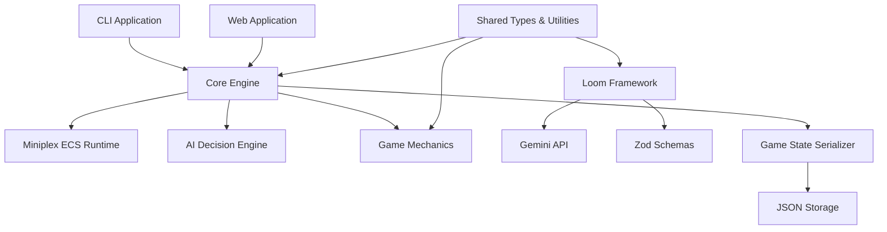
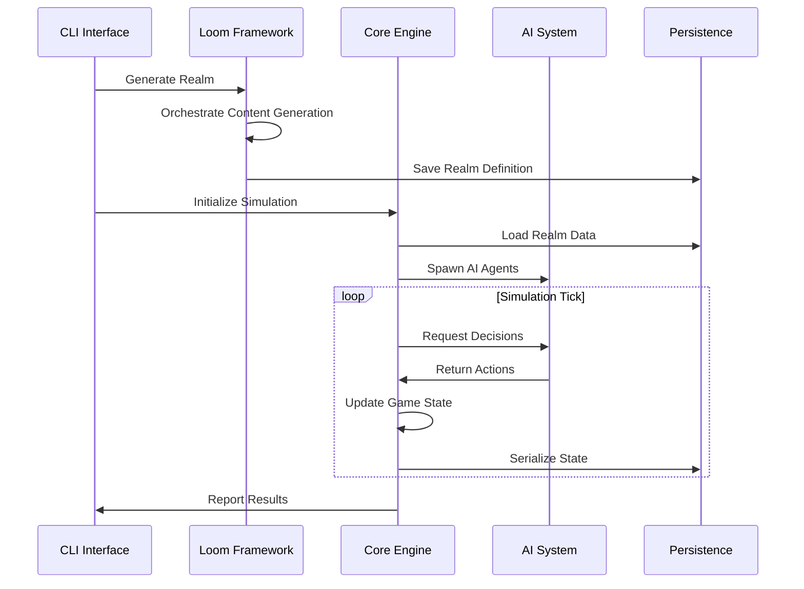

# Design Document

## Overview

RealmWalker v0.1 implements an engine-first procedural RPG architecture built on the principle of empirical verification. The system follows a "headless first" philosophy where game logic is proven correct in a text-only environment before any graphics are rendered. The architecture consists of four main layers: the ECS runtime core, the procedural generation framework (Looms), the AI decision engine, and the persistence/serialization system.

The design emphasizes deterministic behavior, comprehensive testing, and modular architecture to ensure reliability and maintainability. All game state transitions are predictable and reproducible, enabling mathematical verification of game correctness.

## Architecture

### High-Level Architecture



### Package Architecture

The system is organized as a monorepo with clear separation of concerns:

- **@realm-walker/core**: ECS runtime, game loop, world management
- **@realm-walker/looms**: Procedural generation framework with Gemini integration
- **@realm-walker/mechanics**: RPG rules, equipment systems, game mechanics
- **@realm-walker/ai**: Yuka-based AI decision engine and pathfinding
- **@realm-walker/shared**: Common types, schemas, utilities, and contracts
- **@realm-walker/cli**: Command-line interface for headless simulation
- **@realm-walker/game**: React/Vite web application for visual gameplay

### Data Flow



## Components and Interfaces

### Core Engine Components

#### World (ECS Runtime)
```typescript
class World extends MiniplexWorld<Entity> {
    public rng: Prng;
    constructor(seed: string);
    create(components: Partial<Entity>): Entity;
}
```

The World class extends Miniplex's ECS runtime with deterministic random number generation. It ensures all entity creation and state changes are reproducible given the same seed.

#### Game Loop
```typescript
interface GameLoop {
    tick(): void;
    run(tickCount: number): void;
    getState(): GameState;
}
```

The game loop implements fixed timestep updates with deterministic ordering of all system updates.

#### Action Handler
```typescript
interface ActionHandler {
    validateAction(action: GameAction, entity: Entity): boolean;
    executeAction(action: GameAction, entity: Entity): ActionResult;
}
```

Validates and executes all game actions according to defined rules.

### Loom Framework Components

#### Loom Definition
```typescript
interface LoomDefinition<TInput, TOutput, TContext> {
    name: string;
    tags: string[];
    consumes?: string[];
    produces: string[];
    schema: ZodSchema<TOutput>;
    model?: GeminiModel;
    pattern: (input: TInput, tapestry: Tapestry<TContext>) => string;
    verify?: (output: TOutput, input: TInput) => void;
}
```

Defines a procedural generation task with dependencies, validation, and AI prompt patterns.

#### Tapestry (Orchestrator)
```typescript
class Tapestry<TContext> {
    weave(settings: LoomSettings): Promise<TContext>;
    get<K extends keyof TContext>(key: K): TContext[K];
    set<K extends keyof TContext>(key: K, value: TContext[K]): void;
}
```

Orchestrates multiple Looms with dependency resolution and context management.

#### Shuttle (Job Wrapper)
```typescript
class Shuttle<TInput, TOutput, TContext> {
    launch(input: TInput, tapestry: Tapestry<TContext>): Promise<TOutput>;
}
```

Wraps Loom execution with error handling, retries, and validation.

### AI System Components

#### AI Agent
```typescript
interface AIAgent {
    id: string;
    state: AIState;
    decide(gameState: SerializedGameState): GameAction;
    update(deltaTime: number): void;
}
```

Represents an AI-controlled entity with decision-making capabilities.

#### Decision Engine
```typescript
interface DecisionEngine {
    evaluateOptions(agent: AIAgent, gameState: GameState): GameAction[];
    selectAction(options: GameAction[]): GameAction;
}
```

Implements decision-making logic using Yuka framework for pathfinding and behavior trees.

## Archetypal Loom DDL Architecture

Based on comprehensive research of mid-1990s RPGs (Final Fantasy VI, Chrono Trigger, Secret of Mana), the system implements archetypal Loom DDLs that capture proven game design patterns.

### RPG Research Analysis

#### Final Fantasy VI Patterns
- **Esper System**: Magic learning through equipped Espers with stat bonuses on level up
- **Relic System**: Equipment providing special abilities and stat modifications
- **Character Specialization**: Unique abilities per character with flexible magic learning
- **World Progression**: Linear story with branching exploration and multiple party management

#### Chrono Trigger Patterns  
- **Tech System**: Individual character abilities that combine into dual/triple techs
- **Elemental Combinations**: Fire + Ice = Antipode, Lightning + Water = Ice Water
- **Time Period Mechanics**: Different eras with unique technology and magic levels
- **Character Synergy**: Specific character combinations unlock unique abilities

#### Secret of Mana Patterns
- **Weapon Orb Progression**: Weapons level up through orb collection with branching paths
- **Ring Menu System**: Real-time pause for strategic decision making
- **Cooperative Magic**: Shared spell casting with timing-based power increases
- **Real-time Combat**: Action-based combat with charge meters and positioning

### Archetypal Loom DDL Definitions

#### CharacterProgressionLoom
```typescript
interface CharacterProgressionLoom extends LoomDefinition<
  CharacterProgressionInput,
  CharacterProgressionOutput,
  RealmContext
> {
  name: "CharacterProgressionLoom";
  consumes: ["world", "classes"];
  produces: ["characterProgression"];
  
  // Based on FF6 Esper bonuses, CT tech learning, SoM weapon mastery
  pattern: (input, tapestry) => `
    Generate a character progression system for ${input.characterClass} in a ${tapestry.get('world').age} setting.
    
    Base Patterns:
    - FF6 Style: Stat bonuses on level up through equipped items/spirits
    - CT Style: Ability learning through experience with combination potential  
    - SoM Style: Skill mastery through repeated use with branching specializations
    
    Include:
    - Primary progression mechanic (levels, skills, or mastery)
    - Stat growth patterns and bonuses
    - Ability/spell learning conditions
    - Equipment interaction with progression
    - Unique character specializations
    
    Technology Level: ${tapestry.get('world').technologyLevel}
    Magic Level: ${tapestry.get('world').magicLevel}
  `;
}
```

#### EquipmentSystemLoom
```typescript
interface EquipmentSystemLoom extends LoomDefinition<
  EquipmentSystemInput,
  EquipmentSystemOutput,
  RealmContext
> {
  name: "EquipmentSystemLoom";
  consumes: ["world", "characterProgression"];
  produces: ["equipmentSystem"];
  
  // Based on FF6 Relics, CT accessories, SoM weapon orbs
  pattern: (input, tapestry) => `
    Generate an equipment system for ${input.equipmentType} in a ${tapestry.get('world').age} world.
    
    Base Patterns:
    - FF6 Style: Relics providing special abilities and stat modifications
    - CT Style: Accessories enhancing character abilities and tech combinations
    - SoM Style: Weapon orbs creating branching upgrade paths with specializations
    
    Include:
    - Equipment categories and slot limitations
    - Stat modification formulas
    - Special abilities and passive effects
    - Upgrade/enhancement mechanics
    - Rarity and acquisition methods
    
    Character Progression: ${JSON.stringify(tapestry.get('characterProgression'))}
    Danger Level: ${tapestry.get('world').dangerLevel}
  `;
}
```

#### MagicSystemLoom
```typescript
interface MagicSystemLoom extends LoomDefinition<
  MagicSystemInput,
  MagicSystemOutput,
  RealmContext
> {
  name: "MagicSystemLoom";
  consumes: ["world", "characterProgression", "equipmentSystem"];
  produces: ["magicSystem"];
  
  // Based on FF6 Esper magic, CT elemental combos, SoM cooperative casting
  pattern: (input, tapestry) => `
    Generate a magic system for ${input.magicSchool} in a ${tapestry.get('world').age} setting.
    
    Base Patterns:
    - FF6 Style: Magic learned from equipped Espers with AP accumulation
    - CT Style: Elemental spells that combine between characters for enhanced effects
    - SoM Style: Shared magic progression with cooperative casting mechanics
    
    Include:
    - Spell learning and progression mechanics
    - Elemental interactions and combinations
    - MP/resource management systems
    - Multi-character cooperation possibilities
    - Visual and mechanical spell effects
    
    Magic Level: ${tapestry.get('world').magicLevel}
    Available Equipment: ${JSON.stringify(tapestry.get('equipmentSystem'))}
  `;
}
```

#### CombatMechanicsLoom
```typescript
interface CombatMechanicsLoom extends LoomDefinition<
  CombatMechanicsInput,
  CombatMechanicsOutput,
  RealmContext
> {
  name: "CombatMechanicsLoom";
  consumes: ["world", "characterProgression", "magicSystem"];
  produces: ["combatMechanics"];
  
  // Based on FF6 turn-based, CT combo attacks, SoM real-time action
  pattern: (input, tapestry) => `
    Generate combat mechanics for ${input.combatStyle} in a ${tapestry.get('world').age} world.
    
    Base Patterns:
    - FF6 Style: Turn-based combat with ATB system and formation tactics
    - CT Style: Positional combat with dual/triple tech combinations
    - SoM Style: Real-time action combat with charge meters and positioning
    
    Include:
    - Initiative/timing systems
    - Action selection and execution
    - Character cooperation mechanics
    - Status effects and conditions
    - Victory/defeat conditions
    
    Magic System: ${JSON.stringify(tapestry.get('magicSystem'))}
    Character Abilities: ${JSON.stringify(tapestry.get('characterProgression'))}
  `;
}
```

#### WorldStructureLoom
```typescript
interface WorldStructureLoom extends LoomDefinition<
  WorldStructureInput,
  WorldStructureOutput,
  RealmContext
> {
  name: "WorldStructureLoom";
  consumes: ["world"];
  produces: ["worldStructure"];
  
  // Based on FF6 world map, CT time periods, SoM interconnected regions
  pattern: (input, tapestry) => `
    Generate world structure for a ${tapestry.get('world').age} realm with ${input.regionCount} regions.
    
    Base Patterns:
    - FF6 Style: Overworld map with towns, dungeons, and secret locations
    - CT Style: Multiple time periods with location evolution and connections
    - SoM Style: Interconnected regions with travel restrictions and progression gates
    
    Include:
    - Region types and characteristics
    - Travel mechanics and restrictions
    - Location interconnections and dependencies
    - Progression gating and unlock conditions
    - Hidden areas and secret locations
    
    Technology Level: ${tapestry.get('world').technologyLevel}
    Danger Level: ${tapestry.get('world').dangerLevel}
  `;
}
```

### GenAI Prompt Engine Architecture

The system includes sophisticated prompt engines for generating both textual content and image generation prompts based on archetypal RPG patterns.

#### Prompt Engine Components

```typescript
interface PromptEngine {
  generateCharacterContent(character: CharacterData, context: RealmContext): ContentOutput;
  generateEquipmentContent(equipment: EquipmentData, context: RealmContext): ContentOutput;
  generateMagicContent(spell: MagicData, context: RealmContext): ContentOutput;
  generateLocationContent(location: LocationData, context: RealmContext): ContentOutput;
}

interface ContentOutput {
  textContent: {
    name: string;
    description: string;
    lore: string;
    flavorText: string;
  };
  imagePrompts: {
    portraitPrompt: string;
    actionPrompt: string;
    iconPrompt: string;
  };
  validationSchema: ZodSchema;
}
```

#### Character Content Generation
Based on archetypal RPG character patterns from FF6 (diverse backgrounds, tragic histories), CT (time-displaced heroes), and SoM (nature-connected adventurers):

```typescript
const characterPromptPattern = `
Generate character content for a ${character.class} from the ${context.world.age} era.

Archetypal Patterns:
- FF6: Complex backstories with personal tragedies and redemption arcs
- CT: Heroes displaced by time with connections to different eras  
- SoM: Nature-connected characters with elemental affinities

Character Details:
- Class: ${character.class}
- Level: ${character.level}
- Primary Stats: ${character.primaryStats}
- Special Abilities: ${character.abilities}

Generate:
1. Name (appropriate to era and culture)
2. Physical description (including distinctive features)
3. Personality traits and motivations
4. Backstory connecting to world events
5. Relationships with other character archetypes
6. Character arc potential and growth themes

Image Prompts:
- Portrait: Detailed character appearance for profile art
- Action: Character using signature ability in combat
- Icon: Simplified symbol representing the character class
`;
```

#### Equipment Content Generation
Based on iconic equipment from FF6 (Relics with unique abilities), CT (time-period appropriate gear), and SoM (elemental weapon variants):

```typescript
const equipmentPromptPattern = `
Generate equipment content for ${equipment.type} in the ${context.world.age} setting.

Archetypal Patterns:
- FF6: Relics with unique magical properties and stat modifications
- CT: Era-appropriate technology with special combat applications
- SoM: Elemental weapons with visual transformation through upgrades

Equipment Details:
- Type: ${equipment.type}
- Rarity: ${equipment.rarity}
- Stat Modifiers: ${equipment.statModifiers}
- Special Properties: ${equipment.specialProperties}

Generate:
1. Evocative name reflecting properties and origin
2. Detailed physical description including materials and craftsmanship
3. Historical background and creation lore
4. Mechanical effects description in narrative form
5. Acquisition method and rarity justification

Image Prompts:
- Item: Detailed equipment render showing unique features
- Equipped: Character wearing/wielding the equipment
- Icon: Inventory icon emphasizing key visual elements
`;
```

### Complete Tapestry Orchestration System

The Tapestry system orchestrates complex procedural generation workflows with sophisticated dependency management and context sharing.

#### Enhanced Tapestry Architecture

```typescript
class EnhancedTapestry<TContext extends RealmContext> {
  private dependencyGraph: DependencyGraph;
  private contextManager: ContextManager<TContext>;
  private errorRecovery: ErrorRecoverySystem;
  private progressTracker: ProgressTracker;
  
  async weaveComplex(settings: ComplexLoomSettings): Promise<TContext> {
    const executionPlan = this.dependencyGraph.createExecutionPlan();
    const progressCallback = this.progressTracker.createCallback();
    
    for (const phase of executionPlan.phases) {
      await this.executePhase(phase, progressCallback);
    }
    
    return this.contextManager.getFinalContext();
  }
  
  private async executePhase(phase: ExecutionPhase, callback: ProgressCallback): Promise<void> {
    const parallelLooms = phase.getParallelExecutableLooms();
    
    const results = await Promise.allSettled(
      parallelLooms.map(loom => this.executeLoomWithRecovery(loom))
    );
    
    this.handlePhaseResults(results, phase);
    callback(phase.id, results);
  }
  
  private async executeLoomWithRecovery<T>(loom: LoomDefinition<any, T, TContext>): Promise<T> {
    try {
      return await this.shuttle.launch(loom.input, this);
    } catch (error) {
      return await this.errorRecovery.handleLoomFailure(loom, error, this);
    }
  }
}
```

#### Dependency Graph Management

```typescript
interface DependencyGraph {
  addLoom(loom: LoomDefinition<any, any, any>): void;
  createExecutionPlan(): ExecutionPlan;
  validateNoCycles(): boolean;
  getOptimalParallelization(): ExecutionPhase[];
}

interface ExecutionPlan {
  phases: ExecutionPhase[];
  estimatedDuration: number;
  criticalPath: string[];
  parallelizationOpportunities: ParallelGroup[];
}
```

#### Context Sharing and Management

```typescript
interface ContextManager<TContext> {
  shareContext(fromLoom: string, toLoom: string, data: any): void;
  getSharedContext(loomName: string): any;
  validateContextIntegrity(): boolean;
  createContextSnapshot(): TContext;
  rollbackToSnapshot(snapshot: TContext): void;
}
```

#### Error Recovery Strategies

```typescript
interface ErrorRecoverySystem {
  handleLoomFailure<T>(
    loom: LoomDefinition<any, T, any>, 
    error: Error, 
    tapestry: Tapestry<any>
  ): Promise<T>;
  
  registerFallbackStrategy(loomName: string, strategy: FallbackStrategy): void;
  canRecover(error: Error): boolean;
  getRecoveryOptions(error: Error): RecoveryOption[];
}

interface FallbackStrategy {
  useMockData(): boolean;
  retryWithModifiedInput(): boolean;
  skipAndContinue(): boolean;
  useAlternativeLoom(): string | null;
}
```

## Data Models

#### Entity
```typescript
type Entity = {
    id: string;
    position?: Vector3;
    health?: HealthComponent;
    inventory?: InventoryComponent;
    ai?: AIComponent;
    [key: string]: any;
};
```

Flexible entity structure supporting dynamic component addition.

#### Game State
```typescript
interface GameState {
    tick: number;
    entities: Entity[];
    worldSeed: string;
    metadata: GameMetadata;
}
```

Complete serializable game state representation.

### Procedural Content Models

#### Realm Definition
```typescript
interface RealmDefinition {
    world: RpgLoom;
    factions: RpgFaction[];
    classes: RpgClass[];
    items: RpgItem[];
    bestiary: RpgBestiary[];
    dungeons: RpgDungeon[];
    quests: RpgQuest[];
}
```

Complete procedurally generated world definition.

#### Loom Settings
```typescript
interface LoomSettings {
    seed: string;
    age: string;
    controls: {
        dangerLevel: number;
        magicLevel: number;
        technologyLevel: number;
        minNodes: number;
    };
}
```

Configuration parameters for procedural generation.

## Correctness Properties

*A property is a characteristic or behavior that should hold true across all valid executions of a system-essentially, a formal statement about what the system should do. Properties serve as the bridge between human-readable specifications and machine-verifiable correctness guarantees.*

### Property Reflection

After analyzing all acceptance criteria, several properties can be consolidated:
- Schema validation properties (1.2, 2.3, 6.4) can be combined into comprehensive validation properties
- Determinism properties (3.1, 3.2, 3.3) are closely related and can be unified
- Serialization properties (6.1, 6.2, 6.3) form a natural round-trip property group
- AI decision properties (4.2, 4.3, 4.5, 7.3) can be consolidated around decision purity and validation

### Core Engine Properties

**Property 1: Deterministic Entity Creation**
*For any* seed value, creating entities in the same order should always produce identical entity IDs and initial states
**Validates: Requirements 1.3**

**Property 2: Schema Validation Completeness**
*For any* generated content or game state data, validation against the corresponding Zod schema should correctly accept valid data and reject invalid data
**Validates: Requirements 1.2, 2.3, 6.4**

**Property 3: Game State Determinism**
*For any* identical initial game state and sequence of actions, multiple simulation runs should produce identical final states
**Validates: Requirements 3.1, 3.2, 3.3**

**Property 4: State Serialization Round Trip**
*For any* valid game state, serializing then deserializing should produce an equivalent game state with all entity relationships and component data preserved
**Validates: Requirements 6.1, 6.2, 6.3**

### Procedural Generation Properties

**Property 5: Loom Content Generation**
*For any* valid Loom definition and input parameters, content generation should produce output that passes schema validation and meets minimum quantity requirements
**Validates: Requirements 2.1, 2.4**

**Property 6: Dependency Orchestration**
*For any* set of Looms with defined dependencies, the Tapestry orchestration should execute them in correct dependency order without circular dependencies
**Validates: Requirements 2.5**

**Property 7: Generation Mode Consistency**
*For any* Loom configuration, both API-based and mock-based generation modes should produce content that passes the same validation rules
**Validates: Requirements 2.6**

### AI System Properties

**Property 8: AI Decision Purity**
*For any* AI agent and serialized game state, decision-making should be deterministic and reproducible based solely on the serialized state data
**Validates: Requirements 4.2, 7.3**

**Property 9: Action Resolution Ordering**
*For any* set of simultaneous AI actions, the resolution order should be deterministic and all actions should be validated against game rules
**Validates: Requirements 4.3, 4.5**

### Simulation Properties

**Property 10: Headless Operation**
*For any* game simulation, execution should complete successfully without any graphics dependencies or visual components
**Validates: Requirements 5.2, 5.6**

**Property 11: Simulation Configuration**
*For any* valid tick count and simulation parameters, the headless simulation should execute for exactly the specified duration and provide detailed state reports
**Validates: Requirements 5.4, 5.3**

### Testing Properties

**Property 12: Test Data Consistency**
*For any* test execution, loading fixture data should produce consistent known world states that enable deterministic test outcomes
**Validates: Requirements 7.2, 7.4**

**Property 13: End-to-End Workflow**
*For any* complete workflow from world generation through gameplay simulation, all components should integrate correctly and produce valid final states
**Validates: Requirements 7.6**

### Architecture Properties

**Property 14: Package Interface Compatibility**
*For any* package update within the workspace, existing interfaces should continue to function correctly and both CLI and web interfaces should use identical core logic
**Validates: Requirements 8.5, 8.6**

### RPG Research and Analysis Properties

**Property 15: RPG Mechanics Analysis Completeness**
*For any* analyzed RPG system (FF6, CT, SoM), the research documentation should capture all core mechanics including character progression, equipment systems, magic systems, and combat mechanics with sufficient detail for implementation
**Validates: Requirements 9.1, 9.2, 9.3, 9.4, 9.5**

**Property 16: Archetypal Pattern Identification**
*For any* set of RPG mechanics across multiple games, the comparative analysis should identify common patterns and unique innovations that can be abstracted into archetypal Loom DDLs
**Validates: Requirements 9.5, 9.6**

### Archetypal Loom DDL Properties

**Property 17: Loom DDL Content Generation**
*For any* archetypal Loom DDL (Character, Equipment, Magic, Combat, World), generated content should conform to the specified archetypal patterns and produce valid outputs with proper schemas
**Validates: Requirements 10.1, 10.2, 10.3, 10.4, 10.5, 10.6**

**Property 18: Cross-Loom Content Coherence**
*For any* set of content generated by multiple Loom DDLs, the outputs should be coherent and interconnected, with character progression affecting equipment generation and world data influencing encounter design
**Validates: Requirements 10.6, 12.2**

### GenAI Prompt Engine Properties

**Property 19: Content Generation Quality**
*For any* generated RPG content (characters, equipment, magic, locations), both text descriptions and image prompts should meet quality thresholds and follow archetypal RPG design patterns
**Validates: Requirements 11.1, 11.2, 11.3, 11.4, 11.6**

**Property 20: Multi-Modal Content Consistency**
*For any* RPG element, generated text content and corresponding image generation prompts should be consistent and complementary, describing the same visual and mechanical concepts
**Validates: Requirements 11.5, 11.6**

### Enhanced Tapestry Properties

**Property 21: Complex Dependency Orchestration**
*For any* complex procedural generation workflow with multiple interdependent Looms, the Tapestry should execute them in correct dependency order and handle circular dependency detection
**Validates: Requirements 12.1, 12.2**

**Property 22: Error Recovery and Fallback**
*For any* Loom failure during complex generation workflows, the Tapestry should implement appropriate recovery strategies and maintain workflow integrity
**Validates: Requirements 12.3, 12.4**

**Property 23: Incremental Generation Consistency**
*For any* partially generated realm, adding new content through incremental generation should maintain consistency with existing content and follow established patterns
**Validates: Requirements 12.4, 12.6**

**Property 24: Complete Realm Validation**
*For any* fully generated realm using all archetypal Loom DDLs, the final output should be coherent, interconnected, and follow proven RPG design patterns from the analyzed classic games
**Validates: Requirements 12.6**

## Error Handling

### Loom Framework Error Handling
- **API Rate Limiting**: Exponential backoff with jitter for Gemini API 429 responses
- **Schema Validation Failures**: Automatic retry with adjusted parameters
- **Dependency Resolution**: Clear error messages for circular dependencies or missing inputs
- **Content Generation**: Fallback to mock data when API is unavailable

### ECS Runtime Error Handling
- **Entity Creation**: Validation of component compatibility before entity creation
- **Action Validation**: Comprehensive rule checking before action execution
- **State Transitions**: Rollback capability for invalid state changes
- **Serialization**: Graceful handling of unserializable components

### AI System Error Handling
- **Decision Failures**: Fallback to default behaviors when decision-making fails
- **Pathfinding**: Alternative route calculation when primary paths are blocked
- **State Evaluation**: Safe handling of incomplete or corrupted game state data

## Testing Strategy

### Dual Testing Approach

The system employs both unit testing and property-based testing for comprehensive coverage:

**Unit Tests**: Focus on specific examples, edge cases, and integration points
- Test specific game scenarios with known outcomes
- Validate error conditions and boundary cases
- Verify component integration and API contracts
- Follow the Arrange-Act-Assert pattern: load fixture data (Arrange), execute action (Act), assert expected outcome (Assert)

**Property-Based Tests**: Verify universal properties across all inputs
- Generate random game states and verify deterministic behavior
- Test schema validation with generated valid/invalid data
- Verify round-trip properties for serialization
- Validate AI decision consistency across multiple runs

### Property-Based Testing Configuration

- **Framework**: Vitest with custom property testing utilities
- **Iterations**: Minimum 100 iterations per property test
- **Test Tagging**: Each property test tagged with format: **Feature: realm-walker-v0-1, Property {number}: {property_text}**
- **Failure Analysis**: Detailed counterexample reporting for failed properties

### Testing Patterns

**Determinism Testing**: Run identical scenarios multiple times and verify identical outcomes
**Fuzz Testing**: Generate random inputs to test system robustness
**Integration Testing**: Test complete workflows from world generation to simulation
**Performance Testing**: Verify system performance under various load conditions
**Regression Testing**: Ensure fixes don't break existing functionality
