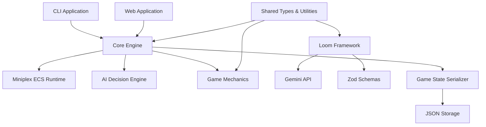
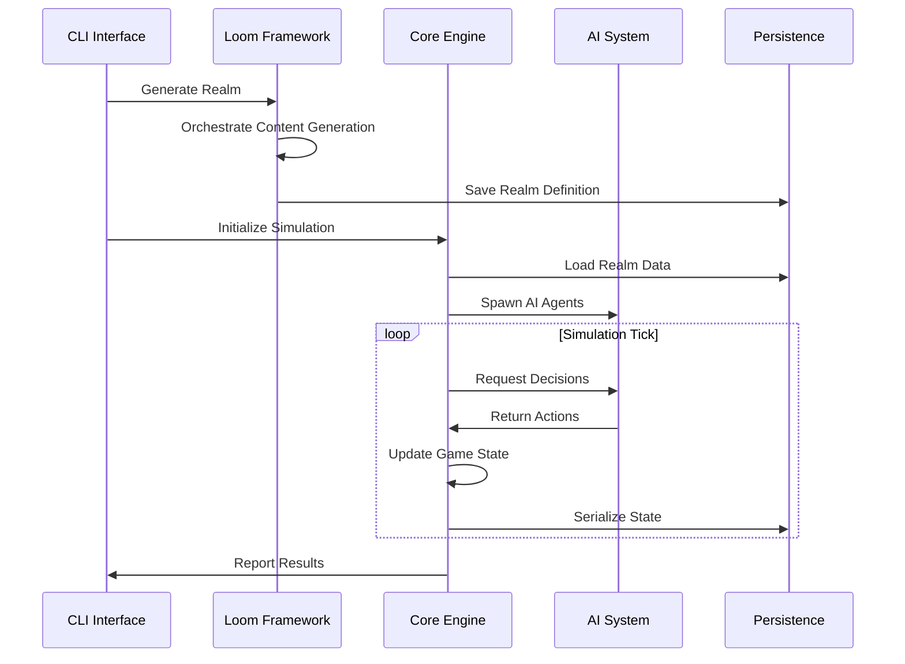

# Design Document

## Overview

RealmWalker v0.1 implements an engine-first procedural RPG architecture built on the principle of empirical verification. The system follows a "headless first" philosophy where game logic is proven correct in a text-only environment before any graphics are rendered. The architecture consists of four main layers: the ECS runtime core, the procedural generation framework (Looms), the AI decision engine, and the persistence/serialization system.

The design emphasizes deterministic behavior, comprehensive testing, and modular architecture to ensure reliability and maintainability. All game state transitions are predictable and reproducible, enabling mathematical verification of game correctness.

## Architecture

### High-Level Architecture



### Package Architecture

The system is organized as a monorepo with clear separation of concerns:

- **@realm-walker/core**: ECS runtime, game loop, world management
- **@realm-walker/looms**: Procedural generation framework with Gemini integration
- **@realm-walker/mechanics**: RPG rules, equipment systems, game mechanics
- **@realm-walker/ai**: Yuka-based AI decision engine and pathfinding
- **@realm-walker/shared**: Common types, schemas, utilities, and contracts
- **@realm-walker/cli**: Command-line interface for headless simulation
- **@realm-walker/game**: React/Vite web application for visual gameplay

### Data Flow



## Components and Interfaces

### Core Engine Components

#### World (ECS Runtime)
```typescript
class World extends MiniplexWorld<Entity> {
    public rng: Prng;
    constructor(seed: string);
    create(components: Partial<Entity>): Entity;
}
```

The World class extends Miniplex's ECS runtime with deterministic random number generation. It ensures all entity creation and state changes are reproducible given the same seed.

#### Game Loop
```typescript
interface GameLoop {
    tick(): void;
    run(tickCount: number): void;
    getState(): GameState;
}
```

The game loop implements fixed timestep updates with deterministic ordering of all system updates.

#### Action Handler
```typescript
interface ActionHandler {
    validateAction(action: GameAction, entity: Entity): boolean;
    executeAction(action: GameAction, entity: Entity): ActionResult;
}
```

Validates and executes all game actions according to defined rules.

### Loom Framework Components

#### Loom Definition
```typescript
interface LoomDefinition<TInput, TOutput, TContext> {
    name: string;
    tags: string[];
    consumes?: string[];
    produces: string[];
    schema: ZodSchema<TOutput>;
    model?: GeminiModel;
    pattern: (input: TInput, tapestry: Tapestry<TContext>) => string;
    verify?: (output: TOutput, input: TInput) => void;
}
```

Defines a procedural generation task with dependencies, validation, and AI prompt patterns.

#### Tapestry (Orchestrator)
```typescript
class Tapestry<TContext> {
    weave(settings: LoomSettings): Promise<TContext>;
    get<K extends keyof TContext>(key: K): TContext[K];
    set<K extends keyof TContext>(key: K, value: TContext[K]): void;
}
```

Orchestrates multiple Looms with dependency resolution and context management.

#### Shuttle (Job Wrapper)
```typescript
class Shuttle<TInput, TOutput, TContext> {
    launch(input: TInput, tapestry: Tapestry<TContext>): Promise<TOutput>;
}
```

Wraps Loom execution with error handling, retries, and validation.

### AI System Components

#### AI Agent
```typescript
interface AIAgent {
    id: string;
    state: AIState;
    decide(gameState: SerializedGameState): GameAction;
    update(deltaTime: number): void;
}
```

Represents an AI-controlled entity with decision-making capabilities.

#### Decision Engine
```typescript
interface DecisionEngine {
    evaluateOptions(agent: AIAgent, gameState: GameState): GameAction[];
    selectAction(options: GameAction[]): GameAction;
}
```

Implements decision-making logic using Yuka framework for pathfinding and behavior trees.

## Data Models

### Core Game Entities

#### Entity
```typescript
type Entity = {
    id: string;
    position?: Vector3;
    health?: HealthComponent;
    inventory?: InventoryComponent;
    ai?: AIComponent;
    [key: string]: any;
};
```

Flexible entity structure supporting dynamic component addition.

#### Game State
```typescript
interface GameState {
    tick: number;
    entities: Entity[];
    worldSeed: string;
    metadata: GameMetadata;
}
```

Complete serializable game state representation.

### Procedural Content Models

#### Realm Definition
```typescript
interface RealmDefinition {
    world: RpgLoom;
    factions: RpgFaction[];
    classes: RpgClass[];
    items: RpgItem[];
    bestiary: RpgBestiary[];
    dungeons: RpgDungeon[];
    quests: RpgQuest[];
}
```

Complete procedurally generated world definition.

#### Loom Settings
```typescript
interface LoomSettings {
    seed: string;
    age: string;
    controls: {
        dangerLevel: number;
        magicLevel: number;
        technologyLevel: number;
        minNodes: number;
    };
}
```

Configuration parameters for procedural generation.

## Correctness Properties

*A property is a characteristic or behavior that should hold true across all valid executions of a system-essentially, a formal statement about what the system should do. Properties serve as the bridge between human-readable specifications and machine-verifiable correctness guarantees.*

### Property Reflection

After analyzing all acceptance criteria, several properties can be consolidated:
- Schema validation properties (1.2, 2.3, 6.4) can be combined into comprehensive validation properties
- Determinism properties (3.1, 3.2, 3.3) are closely related and can be unified
- Serialization properties (6.1, 6.2, 6.3) form a natural round-trip property group
- AI decision properties (4.2, 4.3, 4.5, 7.3) can be consolidated around decision purity and validation

### Core Engine Properties

**Property 1: Deterministic Entity Creation**
*For any* seed value, creating entities in the same order should always produce identical entity IDs and initial states
**Validates: Requirements 1.3**

**Property 2: Schema Validation Completeness**
*For any* generated content or game state data, validation against the corresponding Zod schema should correctly accept valid data and reject invalid data
**Validates: Requirements 1.2, 2.3, 6.4**

**Property 3: Game State Determinism**
*For any* identical initial game state and sequence of actions, multiple simulation runs should produce identical final states
**Validates: Requirements 3.1, 3.2, 3.3**

**Property 4: State Serialization Round Trip**
*For any* valid game state, serializing then deserializing should produce an equivalent game state with all entity relationships and component data preserved
**Validates: Requirements 6.1, 6.2, 6.3**

### Procedural Generation Properties

**Property 5: Loom Content Generation**
*For any* valid Loom definition and input parameters, content generation should produce output that passes schema validation and meets minimum quantity requirements
**Validates: Requirements 2.1, 2.4**

**Property 6: Dependency Orchestration**
*For any* set of Looms with defined dependencies, the Tapestry orchestration should execute them in correct dependency order without circular dependencies
**Validates: Requirements 2.5**

**Property 7: Generation Mode Consistency**
*For any* Loom configuration, both API-based and mock-based generation modes should produce content that passes the same validation rules
**Validates: Requirements 2.6**

### AI System Properties

**Property 8: AI Decision Purity**
*For any* AI agent and serialized game state, decision-making should be deterministic and reproducible based solely on the serialized state data
**Validates: Requirements 4.2, 7.3**

**Property 9: Action Resolution Ordering**
*For any* set of simultaneous AI actions, the resolution order should be deterministic and all actions should be validated against game rules
**Validates: Requirements 4.3, 4.5**

### Simulation Properties

**Property 10: Headless Operation**
*For any* game simulation, execution should complete successfully without any graphics dependencies or visual components
**Validates: Requirements 5.2, 5.6**

**Property 11: Simulation Configuration**
*For any* valid tick count and simulation parameters, the headless simulation should execute for exactly the specified duration and provide detailed state reports
**Validates: Requirements 5.4, 5.3**

### Testing Properties

**Property 12: Test Data Consistency**
*For any* test execution, loading fixture data should produce consistent known world states that enable deterministic test outcomes
**Validates: Requirements 7.2, 7.4**

**Property 13: End-to-End Workflow**
*For any* complete workflow from world generation through gameplay simulation, all components should integrate correctly and produce valid final states
**Validates: Requirements 7.6**

### Architecture Properties

**Property 14: Package Interface Compatibility**
*For any* package update within the workspace, existing interfaces should continue to function correctly and both CLI and web interfaces should use identical core logic
**Validates: Requirements 8.5, 8.6**

## Error Handling

### Loom Framework Error Handling
- **API Rate Limiting**: Exponential backoff with jitter for Gemini API 429 responses
- **Schema Validation Failures**: Automatic retry with adjusted parameters
- **Dependency Resolution**: Clear error messages for circular dependencies or missing inputs
- **Content Generation**: Fallback to mock data when API is unavailable

### ECS Runtime Error Handling
- **Entity Creation**: Validation of component compatibility before entity creation
- **Action Validation**: Comprehensive rule checking before action execution
- **State Transitions**: Rollback capability for invalid state changes
- **Serialization**: Graceful handling of unserializable components

### AI System Error Handling
- **Decision Failures**: Fallback to default behaviors when decision-making fails
- **Pathfinding**: Alternative route calculation when primary paths are blocked
- **State Evaluation**: Safe handling of incomplete or corrupted game state data

## Testing Strategy

### Dual Testing Approach

The system employs both unit testing and property-based testing for comprehensive coverage:

**Unit Tests**: Focus on specific examples, edge cases, and integration points
- Test specific game scenarios with known outcomes
- Validate error conditions and boundary cases
- Verify component integration and API contracts
- Test the "Noun-Verb-Adjective" pattern: load fixture (Noun), execute action (Verb), assert outcome (Adjective)

**Property-Based Tests**: Verify universal properties across all inputs
- Generate random game states and verify deterministic behavior
- Test schema validation with generated valid/invalid data
- Verify round-trip properties for serialization
- Validate AI decision consistency across multiple runs

### Property-Based Testing Configuration

- **Framework**: Vitest with custom property testing utilities
- **Iterations**: Minimum 100 iterations per property test
- **Test Tagging**: Each property test tagged with format: **Feature: realm-walker-v0-1, Property {number}: {property_text}**
- **Failure Analysis**: Detailed counterexample reporting for failed properties

### Testing Patterns

**Determinism Testing**: Run identical scenarios multiple times and verify identical outcomes
**Fuzz Testing**: Generate random inputs to test system robustness
**Integration Testing**: Test complete workflows from world generation to simulation
**Performance Testing**: Verify system performance under various load conditions
**Regression Testing**: Ensure fixes don't break existing functionality
